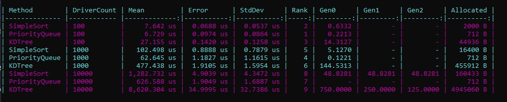

# Система подбора ближайших водителей

Реализация механизма поиска 5 ближайших водителей на прямоугольной сетке размером N × M с использованием трёх различных алгоритмов и сравнением их производительности.

## Описание задачи

- Карта представляет собой дискретную сетку N × M, где 0 <= X < N, 0 <= Y < M.
- Каждая клетка может содержать не более одного водителя.
- Для заданного заказа (координаты X, Y) необходимо найти 5 водителей с минимальным расстоянием до заказа.
- Расстояние вычисляется по евклидовой метрике:  
  d = √((x₁ - x₂)² + (y₁ - y₂)²).

## Результаты бенчмарков

Сравнение производительности трёх алгоритмов при разном количестве водителей:

## Алгоритмы

Проект содержит три стратегии поиска, реализующие общий интерфейс INearestDriverFinder.

### SimpleSort

Алгоритм полного перебора всех водителей с последующей сортировкой по расстоянию. Имеет временную сложность O(D log D), где D — общее количество водителей. Наиболее эффективен при небольшом количестве водителей (D < 1000) благодаря простоте и минимальным накладным расходам.

### PriorityQueue

Алгоритм использует макс-кучу, чтобы поддерживать набор из пяти текущих ближайших водителей. Временная сложность составляет O(D log K), где K = 5. Эффективен при средних и больших объёмах данных.

### KDTree

Алгоритм основан на пространственной структуре данных KD-дерево. После построения дерева выполняется полный обход для сбора всех точек с последующей сортировкой. Построение дерева имеет сложность O(D log D), но демонстрирует лучшую масштабируемость при очень большом количестве водителей.

## Тестирование

Проект покрыт unit-тестами с использованием NUnit:

- Корректность расчёта расстояний
- Правильный порядок водителей в результате
- Обработка крайних случаев (менее 5 водителей, пустая карта)

## Сравнение производительности

Производительность алгоритмов измерена с помощью библиотеки BenchmarkDotNet. Замеры проводились для трёх сценариев с количеством водителей: 100, 1 000 и 10 000.
Из результатов видно, что:
- При малом количестве водителей (100) наиболее быстрым является SimpleSort.
- При увеличении количества водителей преимущество получают PriorityQueue и KDTree за счёт более эффективных стратегий работы с данными.
